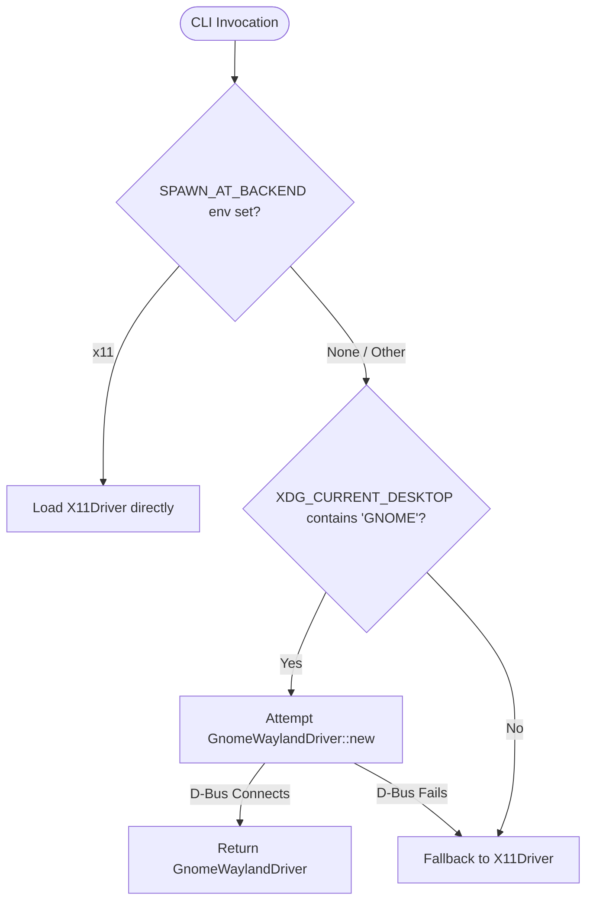
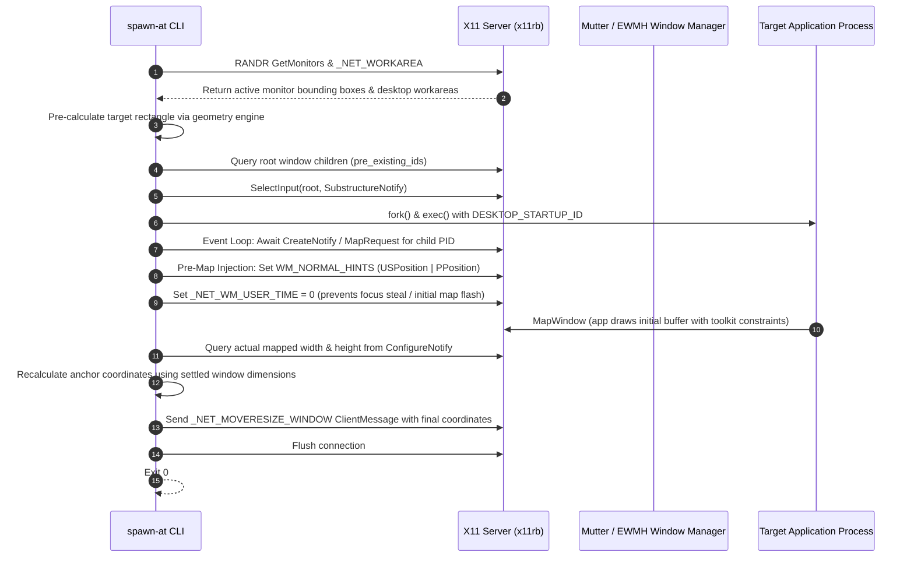
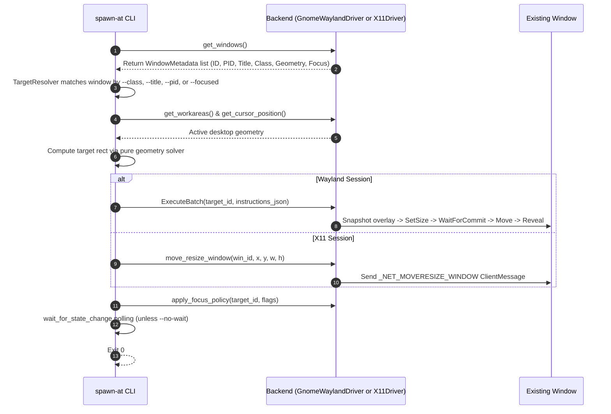
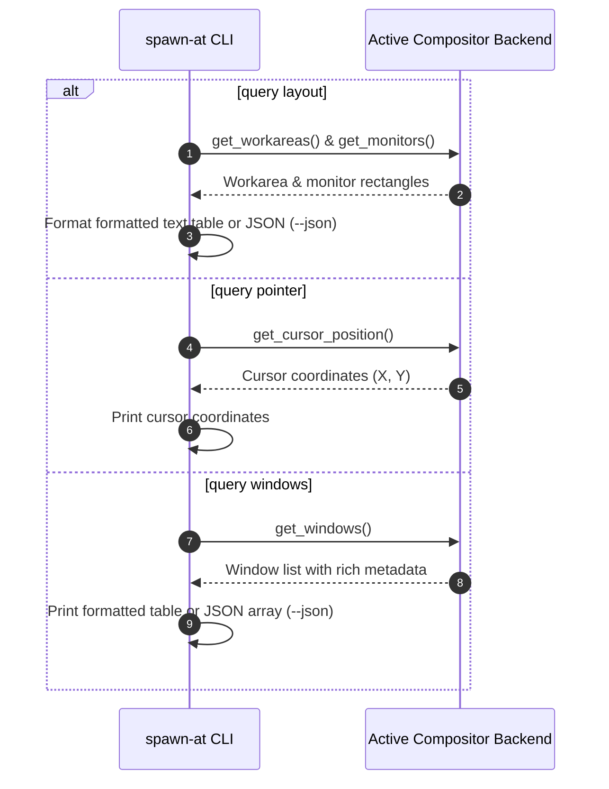

# 00: Current-State System Survey

**Project:** `spawn-at`  
**Current State:** v0.2.0-beta (Cargo packages declare `0.1.0`, git tag `v0.2.0-alpha`)  
**Audit Date:** October 2026  
**Auditor:** Antigravity (DeepMind Advanced Agentic Coding)  
**Host Target Audited:** Linux x86_64, Ubuntu 24.04.5 LTS (Noble Numbat), GNOME Shell 46.0, Linux Kernel 6.8.0  

---

## 1. Complete File Inventory

This table surveys every tracked file in the repository (24 source files across Rust, JS, and Shell, plus repository metadata, documentation, and build scripts). Line counts are derived from `wc -l` on the clean `main` branch (commit `875aead76b63645512904a71169b97d0a5f98839`).

| File Path | Lines | Single Responsibility | Public Items / Exports | Unwraps / Panics / Unsafe (non-test) | TODO / FIXME | OS-Specific Assumptions |
| :--- | :---: | :--- | :--- | :---: | :---: | :--- |
| `Cargo.toml` | 24 | Root workspace manifest and binary crate package specification | Workspace config, package `spawn-at` | 0 | 0 | Unconditionally depends on `zbus` (Linux D-Bus) and `x11rb` (Linux X11) |
| `Cargo.lock` | 1,406 | Pinned dependency resolution tree | N/A | 0 | 0 | None |
| `build.rs` | 60 | Build-time metadata generation (git commit, release tag injection) | `fn main()` | 0 | 0 | Shells out to `git` binary via `std::process::Command` |
| `install.sh` | 197 | Remote bootstrap shell installer script | CLI execution entry | 0 | 0 | Linux x86_64 only; calls `uname`, `curl`, `tar`, `mktemp`, `jq`/`python3` |
| `.github/workflows/release.yml` | 37 | GitHub Actions release builder for tagged releases | CI release job `build-release` | 0 | 0 | Ubuntu 24.04 runner; runs only on `v*` tag push |
| `.gitignore` | 4 | Git ignore rules | N/A | 0 | 0 | `/target`, `*.tar.gz`, `staging/`, `.agent-notes/` |
| `LICENSE` | 22 | Project license text (MIT License) | N/A | 0 | 0 | None |
| `README.md` | 220 | User documentation, installation instructions, CLI reference | N/A | 0 | 0 | Assumes Ubuntu GNOME Wayland & X11 |
| `CONTRIBUTING.md` | 200 | Architecture guide for contributors and backend implementors | N/A | 0 | 0 | Assumes Linux / GNOME / X11 |
| `AI_DEV/system_survey_and_understanding.md` | 439 | Previous architectural survey (partially stale) | N/A | 0 | 0 | Documents past design state |
| `AI_DEV/spawn-at_master_architecture_blueprint.md` | 1,298 | Master architectural blueprint for unbuilt 3-tier daemon | N/A | 0 | 0 | Documents unbuilt future roadmap |
| `crates/spawn-at-core/Cargo.toml` | 14 | Package manifest for pure geometry & scheduling primitives | Package `spawn-at-core` | 0 | 0 | None |
| `crates/spawn-at-core/src/lib.rs` | 12 | Root re-export interface for core crate | Module exports (`driver`, `geometry`) | 0 | 0 | None |
| `crates/spawn-at-core/src/driver.rs` | 120 | Declarative scheduling and driver abstraction types | `Reveal`, `FocusIntent`, `Urgency`, `Entry`, `Batch`, `Armed`, `DriverError`, `Driver` | 0 | 0 | Platform-agnostic |
| `crates/spawn-at-core/src/geometry.rs` | 687 | Pure spatial geometry engine, anchors, pivots, bounds clamping | `Anchor`, `Pivot`, `Area`, `Rect`, `PlacementParams`, `calculate_rect`, `clamp_to_bounds` | 0 | 0 | Platform-agnostic |
| `src/main.rs` | 459 | CLI entrypoint, command router, spawn execution coordinator | `fn main()` | 0 | 0 | Reads `/proc`, runs `loginctl`, relies on `XDG_ACTIVATION_TOKEN` |
| `src/cli.rs` | 916 | Clap argument parser and command line schema definitions | `Cli`, `Commands`, `GeometryArgs`, `SpawnArgs`, `TransformArgs`, etc. | 0 | 0 | Linux-specific install args flattened into generic CLI |
| `src/config.rs` | 188 | Local user configuration parser (`config.toml`) | `Config`, `UpdateConfig`, `WindowMode`, `AppRule` | 0 | 0 | Reads `$HOME/.config/spawn-at/config.toml` |
| `src/target.rs` | 521 | Active window target matching and fuzzy resolution engine | `WindowSelector`, `WindowMetadata`, `resolve_target`, `resolve_target_id` | 1 (sort unwrap) | 0 | Relies on Linux PID semantics |
| `src/update.rs` | 482 | Self-updater, GitHub release checker, background notification | `UpdateArgs`, `perform_upgrade`, `check_for_updates_background` | 5 (path unwraps) | 0 | Predictable `/tmp/spawn-at-update-{tag}`, Linux `0o755` permissions |
| `src/core/mod.rs` | 2 | Trivial 2-line re-export shim | Re-exports `spawn_at_core` | 0 | 0 | None |
| `src/commands/mod.rs` | 502 | Command execution dispatcher and wait helpers | `matches_target`, `wait_for_spawn`, `wait_for_state_change` | 0 | 0 | Relies on process tree and PID polling |
| `src/commands/focus.rs` | 120 | Command handler for `focus` and `defocus` subcommands | `run_focus`, `run_defocus`, `apply_focus_policy` | 0 | 0 | Interacts with display backend |
| `src/commands/lifecycle.rs` | 130 | Command handler for window state transitions | `run_maximize`, `run_minimize`, `run_restore`, `run_unminimize` | 0 | 0 | Interacts with display backend |
| `src/commands/query.rs` | 215 | Command handler for querying layout, cursor, and windows | `run_query` | 0 | 0 | Formats text/JSON output |
| `src/commands/transform.rs` | 124 | Command handler for moving/resizing mapped windows | `run_transform` | 0 | 0 | Interacts with display backend |
| `src/platform/mod.rs` | 192 | Compositor backend abstraction trait and factory | `CompositorBackend`, `init_backend`, `WindowState`, `InstallScope` | 0 | 0 | Linux-only bootstrap |
| `src/platform/installer.rs` | 193 | Binary filesystem installer / uninstaller | `install_binary`, `uninstall_binary` | 0 | 0 | Hardcodes `~/.local/bin` and `/usr/local/bin` |
| `src/platform/escalate.rs` | 84 | Administrative privilege elevation helper | `copy_elevated`, `remove_elevated` | 3 (path unwraps) | 0 | Shells out to `sudo install -D -m 755` and `sudo rm -f` |
| `src/platform/linux/mod.rs` | 216 | Unified Linux backend adapter | `LinuxBackend`, `get_parent_pid`, `is_process_descendant` | 0 | 0 | Reads `/proc/{pid}/stat`, calls `x11rb` directly |
| `src/platform/linux/xdg.rs` | 203 | Desktop entry scanner and App ID resolver | `resolve_command_to_app_id` | 0 | 0 | Scans `/usr/share/applications` and `~/.local/share/applications` |
| `src/platform/linux/x11.rs` | 1,417 | Native X11 EWMH/RandR compositor driver | `X11Driver`, `X11Session`, `calculate_rect_from_placement` | 0 | 0 | Connects to X11 display socket (`DISPLAY` env) |
| `src/platform/linux/gnome/mod.rs` | 803 | GNOME Shell Wayland & X11 compositor driver | `GnomeWaylandDriver`, `is_wayland_session` | 0 | 0 | Reads `/proc`, invokes `loginctl`, session D-Bus |
| `src/platform/linux/gnome/dbus.rs` | 111 | Zbus D-Bus proxy interface and dead daemon stubs | `SpawnAtProxy`, `run_daemon`, `sync_windows` | 0 | 0 | Session D-Bus `org.gnome.Shell` |
| `src/platform/linux/gnome/mechanics.rs` | 174 | GNOME micro-instruction synthesis engine | `Instruction`, `PlacementPayload`, `calculate_placement` | 0 | 0 | Constructs Clutter/Mutter instruction payload |
| `assets/gnome/metadata.json` | 11 | GNOME Shell extension manifest | Metadata JSON | 0 | 0 | GNOME Shell versions 45–48 |
| `assets/gnome/extension.esm.js` | 1,899 | GNOME Shell Extension ECMAScript module | `Extension` subclass export | 0 | 0 | Mutter, Clutter, GLib, Gio, Shell, Meta APIs |
| `assets/gnome/extension.js` | 1,899 | Dead duplicate copy of `extension.esm.js` | Duplicate export | 0 | 0 | Mutter, Clutter, GLib, Gio, Shell, Meta APIs |

---

## 2. Runtime Execution Flows by Session Type

### A. Session Detection Flow


---

### B. Flow 1: Spawn Flow on Ubuntu GNOME (Wayland)
```mermaid
sequenceDiagram
    autonumber
    participant CLI as spawn-at CLI
    participant DBus as Session D-Bus
    participant Ext as GNOME Extension
    participant Kernel as Linux Kernel / procfs
    participant App as Target Application Process

    CLI->>DBus: GetWorkareas() & GetCursor()
    DBus->>Ext: Query active display workareas & pointer (x, y)
    Ext-->>CLI: Return workarea rects & cursor coords
    CLI->>CLI: Calculate placement (Anchor, Pivot, Workarea, Margins)
    CLI->>CLI: Synthesize Batch & Startup Notification Token (TIME, PID)
    CLI->>DBus: ArmSpawn(entry_key, instructions_json)
    DBus->>Ext: Register pre-armed intent in this._armedSpawns Map
    CLI->>App: fork() & exec() with DESKTOP_STARTUP_ID & XDG_ACTIVATION_TOKEN
    App->>Ext: Mutter detects window creation (global.display 'window-created')
    Ext->>Ext: Synchronous Frame-0 Cloak (actor.opacity = 0, OffscreenRedirect.NEVER)
    Ext->>Kernel: Inspect /proc/<pid>/maps for 'libvte' (VTE focus pulse gating)
    Ext->>Ext: Dispatch Instruction Pipeline:
    Note over Ext: 1. SetSize(safeW, safeH) with Geometry Floor Guard
    Note over Ext: 2. WaitForCommit (wait for buffer commit; debounced quiet period)
    Note over Ext: 3. SetPositionAnchored (re-anchor with final committed geometry)
    Note over Ext: 4. Uncloak (restore actor.opacity = 255)
    CLI->>DBus: wait_for_spawn polls GetWindows() until target appears settled
    CLI-->>CLI: Exit 0
```

---

### C. Flow 2: Spawn Flow on Ubuntu GNOME (X11 Native)


---

### D. Flow 3: Transform Flow (Wayland vs X11)


---

### E. Flow 4: Query Flow


---

## 3. Dependency Inventory & Crate Analysis

### Root Crate (`spawn-at`)
- `spawn-at-core`: Path dependency (`crates/spawn-at-core`). Pure geometry and declarative scheduling primitives.
- `clap` (`4.5`): CLI parsing with derive macros.
- `zbus` (`4.4`, features `["blocking", "tokio"]`): Asynchronous D-Bus client for GNOME Shell extension IPC. **OS Limitation: Linux/BSD only.**
- `tokio` (`1.38`, features `["rt-multi-thread", "macros", "process", "time"]`): Asynchronous runtime.
- `serde` (`1.0`, features `["derive"]`) & `serde_json` (`1.0`): Serialization engine.
- `dialoguer` (`0.11`): Terminal interactive menus for `update` and `install` prompts.
- `toml` (`1.1.6`): Configuration file parser.
- `futures-util` (`0.3.34`): Stream extensions for D-Bus signal reception.
- `async-trait` (`0.1.92`): Trait macro for asynchronous backend interfaces.
- `strsim` (`0.11`): Jaro-Winkler string similarity metric for fuzzy window class error suggestions.
- `x11rb` (`0.14`, feature `["randr"]`): Pure-Rust native X11 protocol client. **OS Limitation: Linux/Unix X11 only.**

### Core Crate (`spawn-at-core`)
- `serde` (`1.0`, features `["derive"]`): Primitives serialization.
- `async-trait` (`0.1`): Trait macro for `Driver`.
- `clap` (`4.5`, optional, feature `clap`): Enables `ValueEnum` on `Anchor`, `Pivot`, and `Area`.

### Duplicate Dependency Analysis (`cargo tree -d`)
- `getrandom`: v0.2.17 vs v0.4.3 (pulled by different transitive sub-dependencies).
- `syn`: v2.0.119 vs v3.0.6 (macro parsing crates).
- `winnow`: v1.0.4 vs v0.7.15 (pulled by `toml` parser transition).
- `toml_edit` / `toml_parser`: multiple versions due to recent toml crate upgrades.

### Cargo Audit & Machete Output

#### `cargo audit` (Executed 2026-10-09)
```text
    Fetching advisory database from `https://github.com/RustSec/advisory-db.git`
      Loaded 795 security advisories (from /home/harsh/.cargo/advisory-db)
    Updating crates.io index
    Scanning Cargo.lock for vulnerabilities (148 crate dependencies)
Success: 0 vulnerabilities found!
```

#### `cargo machete` (Executed 2026-10-09)
```text
Scanning Cargo.toml files for unused dependencies...
cargo-machete: No unused dependencies found!
```

---

## 4. Operating System Assumptions Catalog

| Category | Item / Path | Code Location | Implication / Portability Impact |
| :--- | :--- | :--- | :--- |
| **Filesystem / Procfs** | `/proc/{pid}/stat` | `src/platform/linux/mod.rs:59` | Assumes Linux procfs for parent PID resolution. Breaks on macOS/Windows. |
| **Filesystem / Procfs** | `/proc/{pid}/maps` | `assets/gnome/extension.esm.js:657` | Sync file read in GNOME Shell main loop to detect `libvte`. Non-portable. |
| **Filesystem / Procfs** | `/proc/{pid}/comm` | `assets/gnome/extension.esm.js:667` | Sync file read in GNOME Shell main loop. Non-portable. |
| **System Daemon** | `loginctl` | `src/platform/linux/gnome/mod.rs:161, 197` | Queries `loginctl show-session <id> -p Type --value`. Requires systemd-logind. |
| **Environment Vars** | `XDG_CURRENT_DESKTOP` | `src/platform/linux/mod.rs:100`, `src/update.rs:283` | Detects GNOME desktop environment. Linux/Freedesktop specific. |
| **Environment Vars** | `XDG_ACTIVATION_TOKEN` | `src/main.rs:360`, `src/platform/linux/x11.rs:945` | Wayland activation token standard. |
| **Environment Vars** | `DESKTOP_STARTUP_ID` | `src/main.rs:356`, `src/platform/linux/x11.rs:941` | Freedesktop startup notification token standard for X11 and Wayland. |
| **Environment Vars** | `WAYLAND_DISPLAY` | `src/platform/linux/gnome/mod.rs:222` | Fallback check for Wayland socket. |
| **Environment Vars** | `DISPLAY` | `src/platform/linux/x11.rs` (implicit via `x11rb`) | Connects to X11 display socket. |
| **Hardcoded Paths** | `~/.local/bin` | `src/platform/installer.rs:41` | Default user binary install path. Unix specific. |
| **Hardcoded Paths** | `/usr/local/bin` | `src/platform/installer.rs:43` | Default system binary install path. Unix specific. |
| **Hardcoded Paths** | `~/.local/share/gnome-shell/extensions/...` | `src/platform/linux/gnome/mod.rs:295` | GNOME Shell user extensions directory. |
| **Hardcoded Paths** | `/tmp/spawn-at-update-{tag}` | `src/update.rs:230` | Insecure predictable temporary directory in `/tmp`. Security risk. |
| **Privilege Escalation** | `sudo install -D -m 755` | `src/platform/escalate.rs:15` | Assumes GNU `install` binary and `sudo`. Breaks on non-GNU/macOS/Windows. |
| **IPC Infrastructure** | D-Bus Session Bus (`org.gnome.Shell`) | `src/platform/linux/gnome/dbus.rs` | Requires active D-Bus daemon and GNOME Shell D-Bus service. |
| **External Binaries** | `git`, `curl`, `tar`, `sudo` | Multiple build and runtime locations | Assumes external command availability in `$PATH`. |

---

## 5. Extension Claim-Matching Rules & Safety Analysis

### Claim-Matching Algorithm (`assets/gnome/extension.esm.js:714-777`)
When any window is created or mapped, the extension extracts window identifiers via:
1. `window.get_startup_id()` (Freedesktop `DESKTOP_STARTUP_ID`)
2. `window.get_wm_class()` (X11 `WM_CLASS` / Wayland App ID)
3. `window.get_gtk_application_id()`
4. `window.get_sandboxed_app_id()` (Flatpak / Snap)

The candidate key is evaluated against `this._armedSpawns` map in two stages:
1. **Exact Key Match:** If any identifier exactly matches a pending armed key in `_armedSpawns`.
2. **Case-Insensitive Substring Match Fallback:**
   ```javascript
   if (lowerId.includes(lowerKey) || lowerKey.includes(lowerId)) return key;
   ```
3. **Wildcard Match Fallback:** If `target_id === "*"` or empty, claimed by `this._wildcardTarget`.

### Expiry Timers:
- **Specific Targets:** `ARM_EXPIRY_MS = 15000` (15 seconds before unclaiming).
- **Wildcard Targets:** `WILDCARD_EXPIRY_MS = 1200` (1.2 seconds before unclaiming).

### Worst-Case Mis-Claim Scenario:
Due to the bi-directional substring match (`lowerId.includes(lowerKey) || lowerKey.includes(lowerId)`):
- If the user spawns with a short or common target hint (e.g. `-c edit` or `-c term` or `code`), and the target application fails to launch or takes longer than expected:
- Any unrelated window mapping within the 15-second window whose class or title contains that substring (e.g., `gedit` matching `edit`, or `gnome-terminal` matching `term`) will **mis-claim** the instruction queue!
- The innocent window is cloaked at frame 0, resized, repositioned to the wrong geometry, and uncloaked.
- **Proposed Disarm Option:** A proposed D-Bus method `DisarmSpawn(target_id)` called by the CLI if child spawn fails or times out. (Will require user decision before introducing to D-Bus interface).

---

## 6. CLI Error Handling on `driver.arm()` Failure

In `src/main.rs:347-356`:
```rust
let armed = match driver.arm(batch.clone()).await {
    Ok(a) => a,
    Err(e) => {
        eprintln!("\x1b[1;31mPlacement Error\x1b[0m [driver: {}]: {}", driver.name(), e);
        std::process::exit(1);
    }
};
```
**Current State: Fail-Closed.**
If the GNOME extension is disabled, uninstalled, or D-Bus communication fails, `spawn-at` prints a placement error and exits with code 1 **without launching the application**.
*User Proposal:* Consider a fail-open policy (`--fail-open` or default) where `spawn-at` warns clearly to stderr, launches the application normally without placement environment variables, and exits 0.

---

## 7. Telemetry & `session.log` Audit

### What `session.log` Records Now:
- File location: `~/.local/state/spawn-at/session.log` (marker: `/run/user/<uid>/spawn-at-session.marker`)
- Current Directory Permissions: Created via `GLib.mkdir_with_parents(stateDir, 0o755)` -> **Permissive 0755** instead of private **0700**!
- Current File Permissions: Created with default umask (`0644`) instead of private (`0600`)!
- Metadata Logged:
  - Timestamp (`ISO 8601`) and monotonic delta (`+12.45ms`)
  - Target identifiers: `id`, `pid`, `wmClass`, `appId`, `type` (`Meta.WindowType`), `proto` (`Wayland` vs `XWayland`)
  - Internal pipeline steps: `ARM_SPAWN`, `WINDOW_CREATED`, `ACTOR_MAP`, `BATCH_STEP`, `COMMIT_SIGNAL`, `COMMIT_RESOLVED`, `UNCLOAK_COMPLETE`, `ANCHOR_DISARM`
  - Window frame and buffer dimensions: `(x, y, w, h)`
- **Privacy Assessment:** Window titles and text contents are **NOT** logged. Only window class, application ID, PID, and geometry bounding boxes are recorded. Directory permissions will be tightened to `0700` and file to `0600`.
