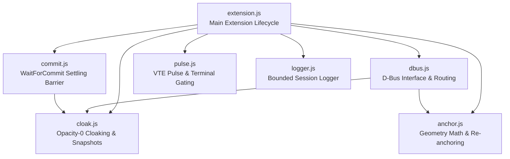

# 03: Target Architecture & Reorganisation Blueprint

**Project:** `spawn-at`  
**Target Release:** v0.2.0-beta.1  
**Auditor:** Antigravity (DeepMind Advanced Agentic Coding)  

This blueprint outlines the restructured codebase layout, trait refactoring for cross-OS extensibility, the modularization of the GNOME Shell extension into ECMAScript modules, file splitting plans, and slotting for future architectural crates.

---

## 1. Before vs. After Repository Structure

### Current Layout (Before)
```text
spawn-at/
├── Cargo.toml                              (Unconditional Linux dependencies: zbus, x11rb)
├── Cargo.lock
├── build.rs
├── install.sh
├── .github/workflows/release.yml           (Only triggers on tags; no CI for main/PRs)
├── LICENSE
├── README.md                               (Placeholders, false --clamp claim)
├── CONTRIBUTING.md                         (Stale TargetGeometry docs)
├── assets/gnome/
│   ├── metadata.json
│   ├── extension.esm.js                    (1,899 lines - MONOLITH)
│   └── extension.js                        (1,899 lines - DEAD DUPLICATE)
├── crates/spawn-at-core/
│   ├── Cargo.toml                          (Missing license field)
│   └── src/
│       ├── lib.rs
│       ├── driver.rs                       (Batch, Entry, Driver trait)
│       └── geometry.rs                     (687 lines; includes dead v0.1 math)
└── src/
    ├── main.rs                             (459 lines; contains hardcoded "X11" check)
    ├── cli.rs                              (916 lines; contains ~500 lines of tests)
    ├── config.rs                           (188 lines; contains dead WindowMode & AppRule)
    ├── target.rs                           (521 lines; unhandled NaN sort unwrap)
    ├── update.rs                           (482 lines; predictable /tmp, deploys old extension)
    ├── core/
    │   └── mod.rs                          (2 lines - DEAD RE-EXPORT SHIM)
    ├── commands/
    │   ├── mod.rs                          (502 lines; command wait helpers + tests)
    │   ├── focus.rs                        (120 lines)
    │   ├── lifecycle.rs                    (130 lines)
    │   ├── query.rs                        (215 lines)
    │   └── transform.rs                    (124 lines)
    └── platform/
        ├── mod.rs                          (192 lines; CompositorBackend has 17 methods)
        ├── installer.rs                    (193 lines; embeds single extension file)
        ├── escalate.rs                     (84 lines; unsafe path unwraps)
        └── linux/
            ├── mod.rs                      (216 lines; misleading function names)
            ├── xdg.rs                      (203 lines)
            ├── x11.rs                      (1,417 lines - MONOLITH with duplicate geometry & eprintln!)
            └── gnome/
                ├── mod.rs                  (803 lines - named GnomeWaylandDriver for X11 & Wayland)
                ├── dbus.rs                 (111 lines; dead run_daemon & sync_windows)
                └── mechanics.rs            (174 lines; duplicate anchor math)
```

### Proposed Target Layout (After)
```text
spawn-at/
├── Cargo.toml                              (Workspace manifest, license="MIT", OS-gated deps)
├── Cargo.lock
├── build.rs
├── install.sh                              (Supports prereleases properly, SHA256 checks)
├── .github/workflows/
│   ├── ci.yml                              (NEW: Automated CI for main pushes & PRs)
│   └── release.yml                         (Automated multi-platform packaging)
├── LICENSE
├── README.md                               (Verified claims, active Ubuntu/GNOME version rows)
├── CONTRIBUTING.md                         (Updated to reflect PlacementParams architecture)
├── docs/
│   └── ADDING_A_BACKEND.md                 (NEW: Step-by-step driver implementation guide)
├── assets/gnome/
│   ├── metadata.json
│   ├── extension.js                        (Main entrypoint: Extension lifecycle, ~180 lines)
│   ├── dbus.js                             (NEW: D-Bus export, method routing & validation, ~220 lines)
│   ├── cloak.js                            (NEW: Opacity-0 cloaking, stage guard, snapshots, ~260 lines)
│   ├── commit.js                           (NEW: WaitForCommit settling barrier & quiet debouncing, ~210 lines)
│   ├── pulse.js                            (NEW: VTE terminal detection & focus pulse, ~140 lines)
│   ├── anchor.js                           (NEW: Anchored positioning, geometry floor & re-anchor, ~280 lines)
│   └── logger.js                           (NEW: Session logger with size-bounded rotation, ~190 lines)
├── crates/spawn-at-core/
│   ├── Cargo.toml                          (license="MIT", description, metadata)
│   └── src/
│       ├── lib.rs
│       ├── capabilities.rs                 (NEW: BackendCapabilities struct)
│       ├── driver.rs                       (Batch, Entry, Driver trait, Armed, DriverError)
│       └── geometry.rs                     (Pure math, Anchor, Pivot, Rect, clamp support, ~450 lines)
└── src/
    ├── main.rs                             (Streamlined CLI entrypoint & orchestration, ~250 lines)
    ├── cli/
    │   ├── mod.rs                          (Top-level parser and command definitions, ~320 lines)
    │   └── args.rs                         (Argument schemas for spawn, transform, query, ~180 lines)
    ├── config.rs                           (Update & notification preferences only, ~110 lines)
    ├── target.rs                           (Window target resolution with total_cmp sort, ~480 lines)
    ├── update.rs                           (Secure temp dir, deploys new release extension, ~420 lines)
    ├── commands/
    │   ├── mod.rs                          (Command dispatcher and polling wait helpers, ~260 lines)
    │   ├── spawn.rs                        (NEW: Dedicated spawn orchestration handler, ~180 lines)
    │   ├── transform.rs                    (Runtime window transformation handler, ~120 lines)
    │   ├── focus.rs                        (Focus and defocus handler, ~120 lines)
    │   ├── lifecycle.rs                    (Maximize, minimize, restore handler, ~130 lines)
    │   └── query.rs                        (Layout, pointer, and window query handler, ~215 lines)
    └── platform/
        ├── mod.rs                          (CompositorBackend trait with capabilities, ~160 lines)
        ├── unsupported.rs                  (NEW: Generic unsupported OS backend for clean cross-compilation)
        ├── installer.rs                    (Multi-file extension embedding & deployment, ~210 lines)
        ├── escalate.rs                     (Privilege elevation with safe OsStr paths, ~80 lines)
        └── linux/
            ├── mod.rs                      (LinuxBackend factory, procfs parent PID resolution)
            ├── xdg.rs                      (Desktop entry scanner and App ID resolution)
            ├── x11/                        (SPLIT: 1,417-line x11.rs decomposed into focused modules)
            │   ├── mod.rs                  (X11Driver implementing CompositorBackend, ~350 lines)
            │   ├── session.rs              (Connection lifecycle, cached atom manager, ~280 lines)
            │   ├── events.rs               (Pre-map event listener, WM_NORMAL_HINTS injection, ~380 lines)
            │   └── query.rs                (RandR monitor and _NET_WORKAREA queries, ~220 lines)
            └── gnome/
                ├── mod.rs                  (GnomeDriver implementing CompositorBackend, ~450 lines)
                ├── dbus.rs                 (Clean zbus proxy; dead run_daemon removed, ~50 lines)
                └── mechanics.rs            (Instruction synthesis delegating to core geometry, ~130 lines)
```

---

## 2. Platform Layering & Trait Redesign for Cross-OS Readiness

### Problem with Current `CompositorBackend`
The current trait has 17 methods, mixing mandatory positioning primitives with optional daemon loops, installation hooks, and window lifecycle transitions. A developer porting `spawn-at` to macOS, Windows, Hyprland, or Sway is forced to stub out dozens of irrelevant methods.

### New Architecture: Capability-Based Trait Model

#### 1. Core Placement Trait (`Driver` in `spawn-at-core`)
```rust
#[async_trait::async_trait]
pub trait Driver: Send + Sync {
    /// Arms the compositor with the declarative batch intent before process launch.
    async fn arm(&self, batch: Batch) -> Result<Armed, DriverError>;
}
```

#### 2. Backend Capabilities Descriptor (`BackendCapabilities` in `spawn-at-core`)
```rust
#[derive(Debug, Clone, Copy, PartialEq, Eq, Default)]
pub struct BackendCapabilities {
    /// Whether the backend supports pre-spawn zero-flicker opacity cloaking
    pub pre_spawn_cloak: bool,
    /// Whether the backend supports runtime repositioning/resizing of mapped windows
    pub runtime_transform: bool,
    /// Whether the backend can query individual monitor workareas (excluding panels)
    pub workarea_queries: bool,
    /// Whether the backend can programmatically focus/defocus windows
    pub focus_management: bool,
    /// Whether the backend can change window state (minimize/maximize/restore)
    pub lifecycle_management: bool,
}
```

#### 3. Streamlined `CompositorBackend` Trait
```rust
#[async_trait::async_trait]
pub trait CompositorBackend: Driver + Send + Sync {
    /// Human-readable name of the backend (e.g. "GNOME Shell", "Native X11", "Hyprland", "macOS")
    fn name(&self) -> &'static str;

    /// Returns the capabilities supported by this driver instance.
    fn capabilities(&self) -> BackendCapabilities;

    /// Resolves an application identifier from a command string.
    fn resolve_id(&self, command: &[String], explicit_class: Option<&str>) -> String;

    // --- Environment Queries ---
    async fn get_cursor_position(&self) -> Result<(i32, i32), DriverError> {
        Err(DriverError::UnsupportedCapability("get_cursor_position"))
    }

    async fn get_monitors(&self) -> Result<Vec<Rect>, DriverError> {
        Ok(Vec::new())
    }

    async fn get_workareas(&self) -> Result<Vec<Rect>, DriverError> {
        self.get_monitors().await
    }

    async fn get_windows(&self) -> Result<Vec<WindowMetadata>, DriverError> {
        Err(DriverError::UnsupportedCapability("get_windows"))
    }

    // --- Runtime Actions ---
    async fn transform_window(
        &self,
        _target_id: &str,
        _params: PlacementParams,
        _current_w: u32,
        _current_h: u32,
    ) -> Result<(), DriverError> {
        Err(DriverError::UnsupportedCapability("transform_window"))
    }

    async fn set_window_state(&self, _target_id: &str, _state: WindowState) -> Result<(), DriverError> {
        Err(DriverError::UnsupportedCapability("set_window_state"))
    }

    async fn focus_window(&self, _target_id: &str) -> Result<(), DriverError> {
        Err(DriverError::UnsupportedCapability("focus_window"))
    }

    async fn defocus_window(&self, _target_id: &str, _mode: &str, _destination: &str) -> Result<(), DriverError> {
        Err(DriverError::UnsupportedCapability("defocus_window"))
    }

    /// Post-spawn synchronization hook (e.g., native X11 SubstructureNotify listener).
    /// Called unconditionally across all backends after process spawn.
    async fn post_spawn(&self, _child_pid: u32, _batch: &Batch) -> Result<(), DriverError> {
        Ok(())
    }

    // --- System Hook Management ---
    fn install(&self, _args: &InstallArgs) -> Result<(), DriverError> {
        Ok(())
    }

    fn uninstall(&self, _args: &UninstallArgs) -> Result<(), DriverError> {
        Ok(())
    }
}
```

#### 4. Unsupported Platform Backend (`src/platform/unsupported.rs`)
For platforms where no driver is yet implemented (macOS, Windows, FreeBSD), `init_backend()` returns an `UnsupportedBackend` instance:
```rust
pub struct UnsupportedBackend {
    os_name: &'static str,
}

#[async_trait::async_trait]
impl Driver for UnsupportedBackend {
    async fn arm(&self, _batch: Batch) -> Result<Armed, DriverError> {
        Err(DriverError::UnsupportedCapability(self.os_name))
    }
}

#[async_trait::async_trait]
impl CompositorBackend for UnsupportedBackend {
    fn name(&self) -> &'static str {
        "Unsupported Platform"
    }
    fn capabilities(&self) -> BackendCapabilities {
        BackendCapabilities::default()
    }
    fn resolve_id(&self, command: &[String], _cls: Option<&str>) -> String {
        command.first().cloned().unwrap_or_default()
    }
}
```
This guarantees that `cargo check --target x86_64-apple-darwin` or `x86_64-pc-windows-msvc` compiles cleanly without missing symbols.

---

## 3. GNOME Shell Extension ESM Modularization Plan

Currently, `assets/gnome/extension.esm.js` is a monolithic 1,899-line file handling everything from Clutter opacity tweaks to D-Bus exports and filesystem logging.

GNOME Shell 45+ natively uses standard ECMAScript modules (`import { ... } from './module.js'`). We will split the extension into 7 focused single-responsibility modules:



### Module Responsibilities & Approximate Line Counts

1. **`extension.js` (~180 lines):**
   - Inherits from `Extension` (`resource:///org/gnome/shell/extensions/extension.js`).
   - Implements `enable()` and `disable()`.
   - Manages global compositor signals (`display 'window-created'`, `stage 'after-update'`).
   - Coordinates orderly teardown and guarantees uncloaking on disable.

2. **`dbus.js` (~220 lines):**
   - Exports the D-Bus interface `org.gnome.Shell.Extensions.SpawnAt` on `/org/gnome/Shell/Extensions/SpawnAt`.
   - Methods: `ArmSpawn`, `ExecuteBatch`, `GetCursor`, `GetPointer`, `GetWorkareas`, `GetWindows`, `MoveWindow`, `FocusWindow`, `DefocusWindow`, `SetWindowState`.
   - Strict input validation: validates `JSON.parse` output is an array of valid instruction objects; bounds `_armedSpawns` capacity.

3. **`cloak.js` (~260 lines):**
   - Applies Frame-0 opacity cloaking (`actor.opacity = 0`, `Clutter.OffscreenRedirect.NEVER`).
   - Manages the `global.stage 'after-update'` safety net that prevents Mutter map animations from revealing unpositioned windows.
   - Creates and tears down snapshot overlays for runtime transformations (`Snapshot`, `DestroySnapshot`).
   - Guarantees fail-safe uncloaking: uncloaks on error, timeout, or disable.

4. **`commit.js` (~210 lines):**
   - Implements `_waitForCommit(window, actor, timeoutMs, targetW, targetH)` settling barrier.
   - Monitors `notify::allocation` and `size-changed` signals with debounced quiet periods (`COMMIT_QUIET_MS = 30ms`).
   - Solves Finding-01: Maintains active tracking set and disconnects all signals on `disable()` or timeout.

5. **`pulse.js` (~140 lines):**
   - Handles the GTK3 / libvte terminal initialization quirk.
   - Asynchronously inspects process identity and delivers synthetic key focus pulse while cloaked to force character grid allocation.

6. **`anchor.js` (~280 lines):**
   - Implements `_stepPosition(ctx, payload)` and `_stepSetSize(ctx, size)`.
   - Two-tier geometry floor protection (`GEOMETRY_FLOOR_W = 100`, `GEOMETRY_FLOOR_H = 60`).
   - Re-applies anchors on late window resizes (1-second post-reveal listener).

7. **`logger.js` (~190 lines):**
   - Asynchronous logging to `~/.local/state/spawn-at/session.log`.
   - Solves Finding-15: Rotates log files when exceeding 5 MB; flushes synchronously on `disable()`.

### Installer Multi-File Embedding Update
Currently, `src/platform/installer.rs` and `src/update.rs` contain:
```rust
const EXTENSION_JS: &str = include_str!("../assets/gnome/extension.esm.js");
```
In the target architecture, `installer.rs` embeds all 7 modular files via a static manifest:
```rust
const EXTENSION_MODULES: &[(&str, &str)] = &[
    ("extension.js", include_str!("../../../assets/gnome/extension.js")),
    ("dbus.js", include_str!("../../../assets/gnome/dbus.js")),
    ("cloak.js", include_str!("../../../assets/gnome/cloak.js")),
    ("commit.js", include_str!("../../../assets/gnome/commit.js")),
    ("pulse.js", include_str!("../../../assets/gnome/pulse.js")),
    ("anchor.js", include_str!("../../../assets/gnome/anchor.js")),
    ("logger.js", include_str!("../../../assets/gnome/logger.js")),
    ("metadata.json", include_str!("../../../assets/gnome/metadata.json")),
];
```
When `spawn-at install` runs, it iterates over `EXTENSION_MODULES` and writes each file to the destination extension folder.

---

## 4. Slotting for Future Coordinator & Protocol Crates

The codebase will be organized to allow smooth addition of the future roadmap crates without breaking changes:

1. **`crates/spawn-at-proto` (Future Protocol Schema):**
   - Houses the binary or JSON schema for inter-process communication between CLI and backends.
   - Can extract `Instruction` and `PlacementPayload` from `gnome/mechanics.rs` so any external coordinator or driver speaks the same contract.
2. **`crates/spawn-at-coordinator` (Future 3-Tier Multi-Window Daemon):**
   - Sits as an independent optional daemon between the CLI and compositor backends.
   - When enabled, `init_backend()` routes through a `CoordinatorClientDriver` connecting via Unix Domain Socket.
   - When disabled or absent, `spawn-at` operates in its fast, direct 2-tier mode.

---

## 5. Explicitly Out of Scope for This Work

To preserve focus and avoid unbounded scope creep, the following are strictly **OUT OF SCOPE**:
1. Implementing new compositor backends (Hyprland, Sway, KDE, macOS, Windows).
2. Building the 3-tier coordinator daemon, Unix Domain Socket listener, or priority preemption queue.
3. Modifying the public CLI syntax, flag names, or D-Bus interface signatures without explicit approval.
4. Rewriting the entire `README.md` prose (only correcting falsehoods, placeholders, and links).
