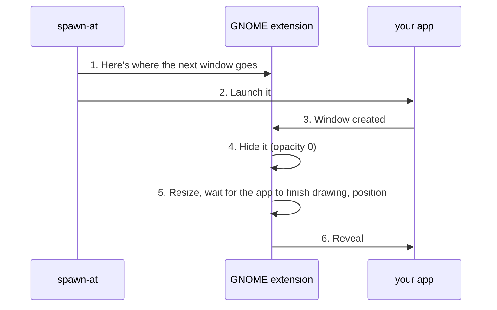
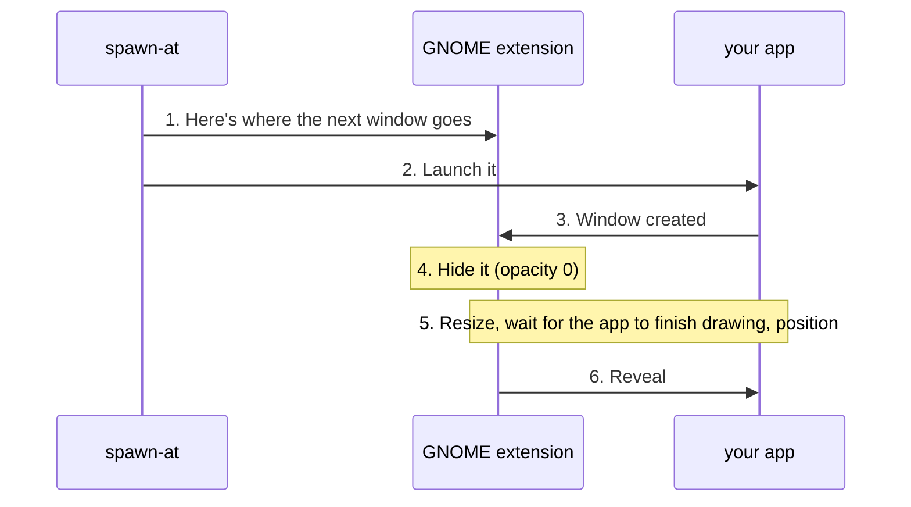

<h1 align="center">spawn-at</h1>

<p align="center">
  <a href="https://github.com/harshp2008/spawn-at/releases"></a>
  <a href="https://github.com/harshp2008/spawn-at/blob/main/Cargo.toml"></a>
  <a href="https://github.com/harshp2008/spawn-at/blob/main/LICENSE"></a>
</p>

**Every desktop places windows differently. That's why no window tool works everywhere.**

Want to open an app at an exact spot and size? On X11 you can move anything, but you'll watch it jump. On Wayland, apps can't place themselves and there's no standard way for anyone else to do it. Each compositor has its own answer, and macOS and Windows are their own worlds.

`spawn-at` is one command and one placement model, with a driver per desktop underneath. The finished driver today is GNOME Shell, on both Wayland and X11. The window stays invisible until it's exactly where you asked.

<!-- TODO: demo gif: split screen. Left: sleep + xdotool script, window flashes at the default spot, then jumps. Right: spawn-at, window just appears in place. Same app, same target. -->

## Install

```bash
# v0.2.0 is in beta, so --prerelease is needed for now
curl -fsSL https://raw.githubusercontent.com/harshp2008/spawn-at/main/install.sh | bash -s -- --prerelease
```

Tested on Ubuntu with GNOME Shell, on both Wayland and X11. On Wayland, log out and back in once so GNOME loads the extension. On X11 the installer reloads the Shell in place and your apps stay open. See [more install options](#more-install-options).

## The problem

| Environment | How you move a window | Catch |
| :--- | :--- | :--- |
| X11 | `xdotool`, `wmctrl` | Works, but only after the window is visible, so it flashes. |
| GNOME / Wayland | A Shell extension (JavaScript) | Apps can't position themselves. Only the compositor can. |
| Hyprland | `hyprctl` | Its own IPC and rule syntax. |
| Sway | `swaymsg` | A different IPC again. |
| KDE Plasma | KWin rules or scripts | Static rules, or KWin's own script API. |
| macOS | Accessibility API | Needs a permission grant, and Spaces get in the way. |
| Windows | Win32 calls | Works per window, but nothing places it before first paint. |

So every window tool ends up X11-only, tied to one compositor, or a pile of per-desktop scripts. Your launcher can't be portable, and your dotfiles break the day you switch desktops.

## What it looks like

The usual way to place a window:

```bash
gnome-terminal &
sleep 0.4                        # guess how long the window takes to appear
xdotool ... windowmove 1200 400 windowsize 700 450
```

The window opens in the wrong place, sits there, then jumps. On native Wayland, `xdotool` can't see it at all.

With spawn-at:

```bash
spawn-at spawn --anchor top-right --size 700 450 -m 24 gnome-terminal
```

It opens at the top-right of your workarea, 24px in from the edges, already sized. Nothing visible in between.

## Things I use it for

```bash
# Calculator popup under the mouse
spawn-at spawn --anchor cursor --pivot center --size 400 500 gnome-calculator

# Scratchpad terminal pinned to the top-right
spawn-at spawn --anchor top-right --pivot top-right --size 800 500 -m 20 alacritty

# Dashboard in the corner that doesn't steal your typing focus
spawn-at spawn --anchor bottom-right --size 600 350 -m 16 --no-focus btop
```

Bind any of these to a GNOME custom shortcut and you have instant floating tools.

It also works on windows that are already open:

```bash
spawn-at transform --class org.gnome.Calculator --anchor center --size 400 500
```

<!-- TODO: demo gif: two hotkeys back to back, calculator at the cursor then a scratchpad terminal at the edge. Both appear in place, no flash. -->

## How it works

Only the compositor can place windows on Wayland, so spawn-at ships a small GNOME Shell extension and talks to it over D-Bus.



Three details do most of the work:

- **Registered before launch.** The extension already knows what to do when the window appears, so there's no race between the window existing and us finding out about it.
- **It waits for the app, not just the compositor.** Resizing a frame doesn't mean the app has drawn into it. The extension watches the app's buffer settle (30ms quiet period, 120ms minimum, 1500ms hard cap) before revealing.
- **A window never stays invisible.** Registrations expire after 15 seconds (1.2s for wildcard matches), unmatched windows are revealed immediately, and errors during placement restore opacity. If something goes wrong you get a normally placed window, not a ghost.

<details>
<summary>More internals</summary>

- **GNOME Terminal quirk.** GTK3/libvte terminals don't lay out their character grid until they get a keyboard focus change. The extension detects libvte via `/proc/<pid>/maps` and pulses focus while the window is still hidden. Other toolkits skip this.
- **Late resizes.** If an app resizes itself after reveal (font loading, client-side decorations), a 1-second listener re-applies your anchor so the window doesn't drift.
- **Concurrent spawns.** Requests go through a queue, so two hotkeys pressed together don't interleave their configure events.
- **Layout math.** Anchors, pivots, margins and clamping live in `spawn-at-core`, pure Rust with no display server dependency. Session type comes from `loginctl`, not `$XDG_SESSION_TYPE`.
- **Minimum-size handling.** GTK3 apps that violate the requested size needed their own handling, and
  the fix for that initially broke GTK4, so both paths are covered now.
</details>

## One CLI, a driver per desktop

The geometry model (10 anchors, 5 pivots, margins, workarea clamping) is shared. A driver only has to answer: where are the screens, where is the cursor, and how do I place and reveal a window.



Wayland is the worst case: no client-side placement, no global window API, and the compositor has to do everything. If one command can place a window with no flash there, the same model should carry to the easier platforms.

## Status

| Environment | Status |
| :--- | :--- |
| Ubuntu, GNOME Shell on Wayland | Tested |
| Ubuntu, GNOME Shell on X11 | Tested |
| Other GNOME-based desktops | Should work (same extension), untested |
| Other X11 desktops | Experimental native driver. No cloaking, so you'll see the flash. |
| Hyprland, Sway, KDE, macOS, Windows | Not implemented |

The extension declares GNOME Shell 45 to 48 in its metadata. Tested on: Ubuntu `<version>`, GNOME Shell `<version>` (fill in from `gnome-shell --version`).

Toolkit coverage: GTK3 and GTK4 apps are tested (6 apps so far), including apps that enforce a minimum
window size. Electron and Qt apps should work but haven't been tested yet. Apps that refuse a requested
size can still end up larger than you asked for, but they're positioned using their final size, so
anchors land correctly.

## Roadmap

Next up: `<pick one: Hyprland / Sway / KDE>`. After that: the rest of the planned drivers. Support only gets claimed for an environment once its live test suite passes there.

## Contributing a backend

Compositors sit behind the `CompositorBackend` trait in [`src/platform/mod.rs`](src/platform/mod.rs). The core of it:

```rust
pub trait CompositorBackend: Driver + Send + Sync {
    fn name(&self) -> &'static str;
    async fn get_cursor_position(&self) -> Result<(i32, i32), DriverError>;
    async fn get_workareas(&self) -> Result<Vec<Rect>, DriverError>;
    async fn transform_window(&self, target_id: &str, params: PlacementParams, w: u32, h: u32) -> Result<(), DriverError>;
    // ...plus focus, state, query and post_spawn methods
}
```

Add a module under `src/platform/linux/` and register it in `LinuxBackend::bootstrap()`.

## More install options

```bash
# Pin a version
curl -fsSL https://raw.githubusercontent.com/harshp2008/spawn-at/main/install.sh | bash -s -- --version v0.2.0-beta

# Headless
curl -fsSL https://raw.githubusercontent.com/harshp2008/spawn-at/main/install.sh | bash -s -- --headless --scope user

# From source
git clone https://github.com/harshp2008/spawn-at.git && cd spawn-at
cargo build --release && ./target/release/spawn-at install
```

<details>
<summary><strong>CLI reference</strong></summary>

Run `spawn-at --help` or `spawn-at <command> --help` for the full list.

| Command | Description |
| :--- | :--- |
| `spawn <cmd...>` | Pre-arm geometry and launch a new app. |
| `transform` | Reposition and resize an already-open window. |
| `focus` / `defocus` | Raise a window, or give focus away (`--to-desktop`, `--to-window <ID>`). |
| `maximize` / `minimize` / `restore` | Change window state. |
| `close` | Request graceful closure of a target window. |
| `query layout\|pointer\|windows` | Print monitors, cursor position, or open windows. `--json` on layout and windows. |
| `install` / `uninstall` | Manage the binary and the GNOME Shell extension. |
| `update` | Check for or apply releases (`--check`, `--channel`, `--force`). |

| Flag | Description |
| :--- | :--- |
| `-p, --pos <X> <Y>` | Absolute position in pixels. |
| `-s, --size <W> <H>` | Window size in pixels. |
| `--anchor` | `center`, `top-left`, `top-right`, `bottom-left`, `bottom-right`, `top`, `bottom`, `left`, `right`, `cursor`. |
| `--pivot` | Which point of the window sits on the anchor: `center`, `top-left`, `top-right`, `bottom-left`, `bottom-right`. |
| `--monitor` | Monitor index, `cursor`, or `primary` (default). |
| `--area` | `workarea` (default) or `screen`. |
| `-m, --margin <PX>` | Margin on all sides (default 16). |
| `--mt`, `--mb`, `--ml`, `--mr` | Per-side margins. |
| `--clamp <true\|false>` | Keep the window inside the area (default true). |
| `--id` / `-c, --class` / `-t, --title` / `--pid` / `--focused` | Pick which window to act on (`--id` matches exact numeric ID from `query windows`). |
| `--focus` / `--no-focus` / `--defocus` | Control focus after the action. |
| `--no-wait` | Exit without waiting for the compositor. |

</details>

## License

MIT. See [LICENSE](LICENSE).